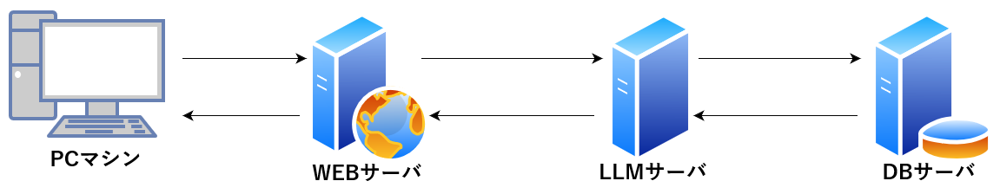

# Chats with LLM

<!--  -->

## Info

Hello, my name is Koki.

For more information on the project, please refer to the Qiita article. 

Please note that this project is a temporary repository for external publication.

## To members of the laboratory

As of 30 May, I am developing the project as an individual, not as a plurality. However, if you are interested you can always contact me. This repository is for external public use and is not up-to-date.

## Need

- Docker Compose
- GPU
- Sufficient memory (about 30 GB in the model alone)

## Private data and model preparation

Download model:

    ```bash:
    python3 /LLM/app/save_model.py
    ```

Your data to index:

    Sorry, will publish at a later date.

## Setup

1. Clone repository：

    ```bash
    git clone https://github.com/Laphroaig-sc/chatbot_v1.git
    ```

2. Moving directories：

    ```bash
    cd chatbot_v1
    ```

3. Start each server using Docker Compose.:

    ```bash
    docker compose up --build
    ```

Docker Compose will now start all the servers and download the required dependencies.
